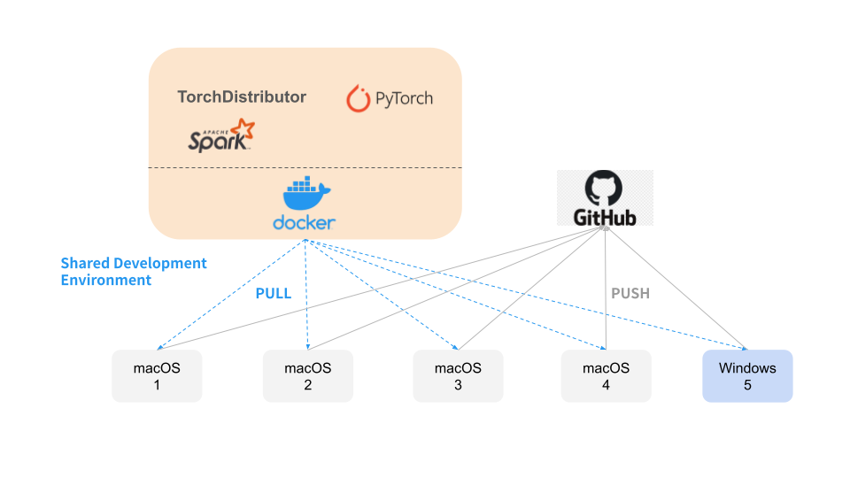

## Collaboration Environment

The technical stack we ustilize to set up our collaboration environment consists of **Docker** and **Github**.

We chose Docker since we have hetogenious devices (4 Macs and 1 Windows) which suits containerization and it is widely used in the industry. We take it as a learning opportunity to increase our knowledge and extend our skillset. It further prevents dependency inconsistency and conflits.

The development environment is built on top of an official pyspark docker image. Each team member can pull it down to their machine and run it locally for coding. 

This ensures the team has an uniform development environment. Afterwards, the team members push their code to the git repository.

### Choice of PySpark, PyTorch and TorchDistributor
We chose PySpark as the framework to develop the scalable and distributed machine learning pipeline.

We chose PyTorch to develop the model since we had two Macs with Apple M1 chip. Both experienced dependency compatibility issues with TensorFlow. 

We investigated both TorchDistributor and Flower (a federated learning framework) for realizing distributed machine learning. We chose TorchDistributor because it is native to Pyspark and for its simplicity and brevity.