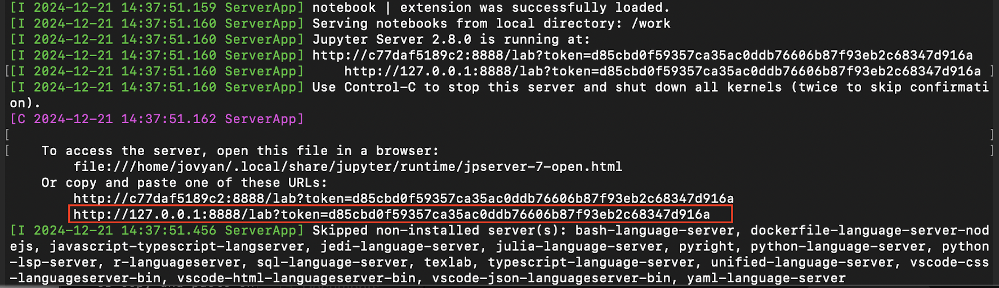

# How to run the project with the PySpark docker image

## 1. Clone the project
Git clone this repo to a directory of your machine:

`git clone https://github.com/PengKuang/team_scalable_timeseries.git`

Then, navigate into the project folder you just cloned.
e.g., on MacOS:

`cd path/to/your/project_name`

For me, it is: 

`cd /Users/pengkuang/team_scalable_timeseries` 

Or if I'm already in my home directory '/Users/pengkuang/' where I git cloned the project: 

`cd team_scalable_timeseries`

## 2. Run the docker image
Assuming that you have already installed the Docker app on your machine and it is up. 

### Step 1
First, pull down this docker image [1]: <https://hub.docker.com/r/jupyter/pyspark-notebook>

`docker pull jupyter/pyspark-notebook`

[1]: _You only need to pull down this docker image once, the first time you tyr to run it. From the second time, you just run it directly with the command below._

Then run it locally: 

`docker run -it -p 8888:8888 -v $(pwd):/work -w /work jupyter/pyspark-notebook`

This command is to run the docker image in an interactive mode, with the port number 8888 and mount your current folder to the work directory in the container. 

### Step 2

#### 2.1 Approch A

Next, go to your terminal and find the link with a token as below. Copy and paste the entire link into your browser and you will log into the container.

  

  The link with a token in the terminal (MacOS example).

#### 2.2 Approch B
Another way to get into the container is to open your browser and go to http://localhost:8888

After that, you should see an unusual login page asking you for a token. 

Go to your terminal to find the link shown above. For this method, you only need to copy the token (the part after '...token='). Paste it in and you can log into the container. 

Read this [article](https://levelup.gitconnected.com/using-docker-and-pyspark-134cd4cab867) if you want to learn more about this approach.

### Step 3

Now you can code freely there. Note that you still need to use 'pip install package_name' to install some libraries such as torch by yourself. 

For team members only:

_All the changes you made in the container will be saved to your local project directory. Once you are happy with it, you can push it to the remote team repository._

## 3. Dataset 

Download the corresponding dataset and move it to your project folder so that the model pipeline can read it (if you do not have it already in the project folder after having cloned the repository). 

ECG5000: <https://www.kaggle.com/code/mineshjethva/ecg-anomaly-detection>
