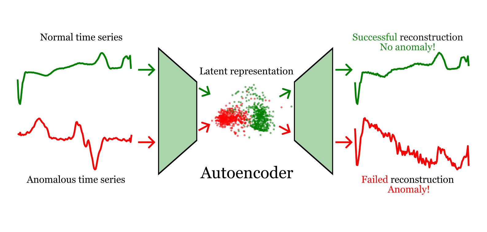

> Project by [Kasper Bågmark](https://research.chalmers.se/person/bagmark), [Michele Di Sabato](https://www.umu.se/en/staff/michele-di-sabato/), [Erik Jansson](https://www.chalmers.se/en/persons/erikjans/), [Peng Kuang](https://portal.research.lu.se/en/persons/peng-kuang) and [Selma Tabakovic](https://www.chalmers.se/en/persons/selmat/)

# Anomaly detection in time series using autoencoders 
The goal of this project is to take a scalable approach to anomaly detection in time series. 
More specifically, we consider electrocardiogram data, i.e., _time series_ of heart rate sequences. The challenge is to reliably detect if such a time series is _anomalous_, or in other words, deviates from healthy heartbeat patterns. 

## Background on time series

A time series is a sequence of real data points indexed by time, i.e., 
$
(x_t,t \in \mathbb{T}), 
$
where $\mathbb{T}$ is an index set, for instance $\mathbb{T} = \{1,2,3,\ldots\}$
 Famous examples include series of temperature data collected for instance daily, or the closing stock price. 
Time series modeling is an important application of the theory of stochastic processes. 
After fitting a stochastic process to the data, i.e., a sequence of random variables indexed by $\mathbb{T}$, the model can be used to answer several questions. 
For instance, one may extract trend lines or seasonality (relevant in for instance financial or climate modeling) and perhaps most importantly, forecast the future. 
Time series models are usually (compared to deep models) simple and easy to fit, with theoretically well understood techniques.  
In this project, we consider the problem of _anomaly detection_, i.e., to, given a previous sample (i.e., training data) of different time series, detect if a new series is anomalous in some way. 
This can be various things, for instance, if the series contains outlier points, if a subset of the series does not fit in what one would expect, or, as is the case for us, if the series is entirely different in some sense from what is expected. 

One viable approach to this would be to fit a time series model to the training data, and using a statistical approach determine if the new series is different from what the model predicts. 
In this project, however, we will avoid the modeling step and instead take a fully data-driven approach using a deep learning technique known as _autoencoders_. 

## Autoencoders

Autoencoders are neural networks that are used to learn embeddings of unlabeled data. 
An autoencoder consists of two networks, the _encoder_ and the _decoder_. 
The encoder learns a representation of the input data into some latent space, and the decoder learns to reconstruct the input data from the representations. 
Formally, the autoencoder consists of a $4$-tuple $(\mathcal D,\mathcal E,\varphi_E,\varphi_D)$.
 $\mathcal D$ is the data space (in our case, the space of time series of a certain length), and $\mathcal E$ is the latent space of representations, in our case chosen to be a Euclidean space of dimension $n$. 
Further, $\varphi_E\colon \mathcal D \to \mathcal E$ is the _encoder_ and $\varphi_D\colon \mathcal E \to \mathcal D$ is the _decoder_. 

The mappings $\varphi_E$ and $\varphi_D$ are parametrized by neural networks. 
In our case, both networks have a simple architecture: they are standard multilayer perceptrons, each with two hidden layers. The latent space (i.e., output dimension of the encoder) is taken to be 16-dimensional. The architecture of the decoder is just the same as that of the encoder, but reversed.  

To train the autoencoder, it is assigned a task to solve. 
In practice, this means selecting a data fidelity measure on $\mathcal{D}$, i.e., a function $d\colon \mathcal{D} \times \mathcal{D} \to \mathbb R$.
Then, given the parametrized coders $\varphi_E^{\theta_E}$ and $\varphi_D^{\theta_D}$, where $\theta_E$ and $\theta_D$ are the parameters of the functions indicated by their subscript, the training problem is to solve
$
\min_{\theta_E,\theta_D} \sum_{i=1}^N d(x_i,\varphi_D^{\theta_D}\circ \varphi_E^{\theta_E}(x_i)) := \min_{\theta_E,\theta_D} \text{loss}(\theta_E,\theta_D)
$
where $\{x_i, i = 1,\ldots N\} \subset \mathcal D$ are the $N$ samples of the training data, e.g., the $N$ time series used to learn what a normal time series should look like. 

