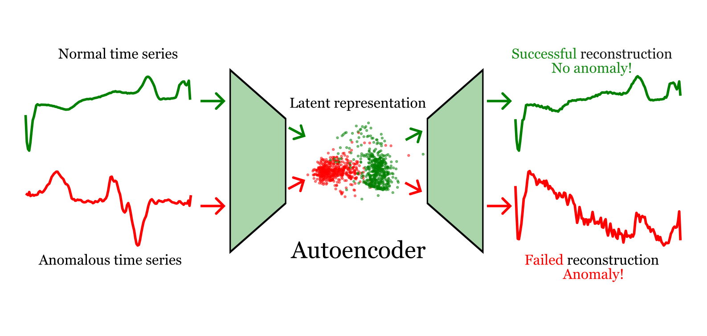
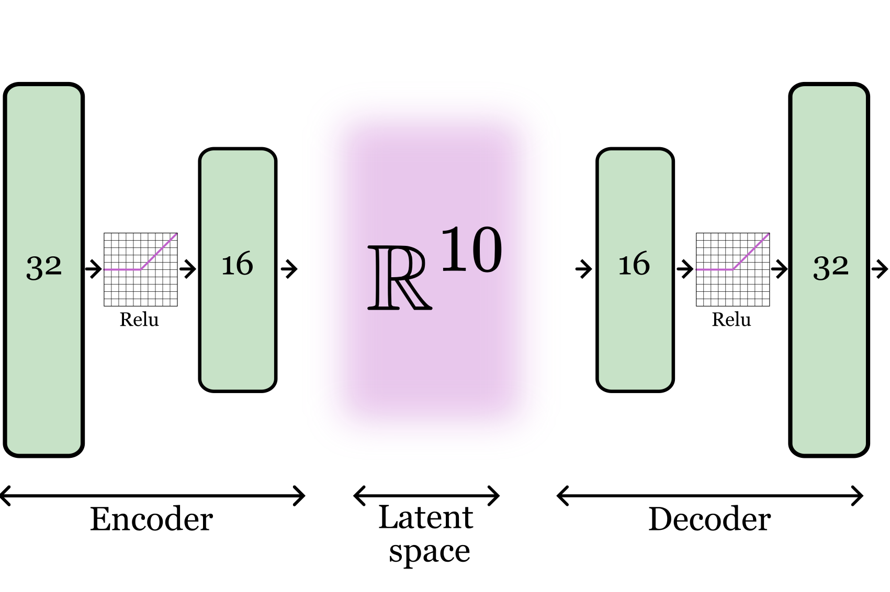

> Project by [Kasper Bågmark](https://research.chalmers.se/person/bagmark), [Michele Di Sabato](https://www.umu.se/en/staff/michele-di-sabato/), [Erik Jansson](https://www.chalmers.se/en/persons/erikjans/), [Peng Kuang](https://portal.research.lu.se/en/persons/peng-kuang) and [Selma Tabakovic](https://www.chalmers.se/en/persons/selmat/)

# Anomaly detection in time series using autoencoders 
The goal of this project is to take a scalable approach to anomaly detection in time series. 
More specifically, we consider electrocardiogram data, i.e., _time series_ of heart rate sequences. The challenge is to reliably detect if such a time series is _anomalous_, or in other words, deviates from healthy heartbeat patterns. 

## Background on time series

A time series is a sequence of real data points indexed by time, i.e., $(x\_t,t \in \mathbb{T})$, where $\mathbb{T}$ is an index set, for instance $\mathbb{T} = \{1,2,3,\ldots\}$. Famous examples include series of temperature data collected for instance daily, or the closing stock price. 
Time series modeling is an important application of the theory of stochastic processes. 
After fitting a stochastic process to the data, i.e., a sequence of random variables indexed by $\mathbb{T}$, the model can be used to answer several questions. 
For instance, one may extract trend lines or seasonality (relevant in for instance financial or climate modeling) and perhaps most importantly, forecast the future. 
Time series models are usually (compared to deep models) simple and easy to fit, with theoretically well understood techniques.  

In this project, we consider the problem of _anomaly detection_, i.e., to, given a previous sample (i.e., training data) of different time series, detect if a new series is anomalous in some way. 
This can be various things, for instance, if the series contains outlier points, if a subset of the series does not fit in what one would expect, or, as is the case for us, if the series is entirely different in some sense from what is expected. 

One viable approach to this would be to fit a time series model to the training data, and using a statistical approach determine if the new series is different from what the model predicts. 
In this project, however, we will avoid the modeling step and instead take a fully data-driven approach using a deep learning technique known as _autoencoders_. 


<p align="center">
  
</p>
<p align="center">
  <sub>Illustration of the anomaly detection procedure. The autoencoder is trained on the normal (green) data. The idea is that normal data will be accurately reconstructed, whereas anomalies are reconstructed poorly.</sub>
</p>

## Autoencoders

Autoencoders are neural networks that are used to learn embeddings of unlabeled data. 
An autoencoder consists of two networks, the _encoder_ and the _decoder_. 
The encoder learns a representation of the input data into some latent space, and the decoder learns to reconstruct the input data from the representations. 
Formally, the autoencoder consists of a $4$-tuple $(\mathcal D,\mathcal E,\varphi_E,\varphi_D)$. $\mathcal D$ is the data space (in our case, the space of time series of a certain length), and $\mathcal E$ is the latent space of representations, in our case chosen to be a Euclidean space of dimension $n$. 
Further, $\varphi_E\colon \mathcal D \to \mathcal E$ is the _encoder_ and $\varphi_D\colon \mathcal E \to \mathcal D$ is the _decoder_. 

The mappings $\varphi_E$ and $\varphi_D$ are parametrized by neural networks. 
In our case, both networks have a simple architecture: they are standard multilayer perceptrons, each with two hidden layers. The latent space (i.e., output dimension of the encoder) is taken to be 16-dimensional. The architecture of the decoder is just the same as that of the encoder, but reversed.  


To train the autoencoder, it is assigned a task to solve. 
In practice, this means selecting a data fidelity measure on $\mathcal{D}$, i.e., a function $d\colon \mathcal{D} \times \mathcal{D} \to \mathbb R$.
Then, given the parametrized coders $\varphi_E^{\theta_E}$ and $\varphi_D^{\theta_D}$, where $\theta_E$ and $\theta_D$ are the parameters of the functions indicated by their subscript, the training problem is to solve $\min_{\theta_E,\theta_D} \sum_{i=1}^N d(x_i,\varphi_D^{\theta_D}\circ \varphi_E^{\theta_E}(x_i)) := \min_{\theta_E,\theta_D} \text{loss}(\theta_E,\theta_D)$ where $\{x_i, i = 1,\ldots N\} \subset \mathcal D$ are the $N$ samples of the training data, e.g., the $N$ time series used to learn what a normal time series should look like. 

<p align="center">
  
</p>
<p align="center">
  <sub>Architecture of the autoencoder when selecting 10 components for the encoded features.</sub>
</p>

## Overview of the ECG5000 dataset
Electrocardiograms (ECGs) are recordings of the electrical activity of the heart, providing vital information about its rhythm and health. Specifically, they are graphs of the heart's electrical voltage over time, measured through electrodes placed on the skin. ECGs are critical tools for diagnosing a range of heart conditions, such as arrhythmias (irregular heartbeats), ischemia (restricted blood flow to the heart), and other cardiac abnormalities. These anomalies often manifest as deviations in the normal trends of the ECG signals.

ECG data is routinely collected in hospitals for patient monitoring, meaning there is, in theory, an abundance of data available for developing machine learning models. Furthermore, the structured and repetitive nature of ECG signals makes them well-suited for models like autoencoders, since autoencoders excel at learning normal patterns from structured data. If trained only on healthy ECGs, the autoencoder will struggle to accurately reconstruct anomalous signals, making deviations from the normal trends identifiable as anomalies. An anomaly detection system based on this data could significantly enhance patient care by serving as an alert system, flagging potential issues to support physicians in their diagnoses.

<p align="center">
    
</p>
<p align="center">
        <sub>Some normal and anomalous ECGs.</sub>
</p>

The ECG5000 dataset is a commonly used benchmark in the field of anomaly detection, particularly for detecting irregularities in heart function. The raw data is collected in [this](https://www.physionet.org/content/chfdb/1.0.0/) repository, and was originally collected in [this work](http://www.ncbi.nlm.nih.gov/entrez/query.fcgi?cmd=Retrieve&db=PubMed&list_uids=3950244&dopt=Abstract). The raw dataset includes long-term ECG recordings from 15 subjects with severe congestive heart failure:
- 11 men (aged 22 to 71).
- 4 women (aged 54 to 63). 

The data was further analyzed and preprocessed in [this work](https://link.springer.com/article/10.1007/s10618-014-0388-4), where the preprocessing pipeline consisted of the following three steps:
1. Individual heartbeats were extracted from the long ECG recordings.
2. Each heartbeat was adjusted to a length of 140 timesteps using interpolation.
3. A total of 5,000 heartbeats were randomly selected for the dataset. 

Note that because the raw data consists of a single, long sequence of ECG evaluations, we only have access to the 5,000 randomly sampled signals, not individual heartbeats.

The final dataset contains:
- 2079 normal heartbeats.
- 2921 anomalous heartbeats (categorized into 4 distinct classes, each representing a specific heart condition).

For our purposes, all anomalies are collected in one single class, which simplifies the task by focusing on detecting abnormal ECGs rather than diagnosing specific conditions. This also aligns with real-world applications where the goal is often to flag unusual signals for further examination by medical professionals.

## Time series anomaly detection using autoencoders

<p align="center">
  
</p>
<p align="center">
  <sub>Summary of anomaly score.</sub>
</p>

The autoencoder is trained on normal, non-anomalous time series, collected in the dataset $\mathcal D$. Each time series is represented in a latent space $\mathcal E$ by the encoder and then the decoder is used to map $\mathcal E$ back to the time series given as input to the model. The underlying assumption is that if the autoencder is fed an anomalous signal, then its reconstruction performance is poor, either because the latent representation of the anomalous signal differs from the one of the training samples or because the reconstruction loss of the abnormal signal is high. This assumption is motivated by the fact that the autoencoder is trained on normal signals.

At inference time, the autoencoder trained on normal signals collected in the dataset $\mathcal D$ is given as input a new time series $\tilde{x}$, that is then mapped to its latent representation and then reconstructed back to $\varphi_D ( \varphi_E(\tilde{x}))$. The technique that we use to understand if the given signal is anomalous or not works in this way. 
1.  We compute the distribution of the reconstruction losses on the training set, namely the distribution of $\{d(z, \varphi_D ( \varphi_E(z))) \ \forall z \in \mathcal D\}$. For ease of notation, we re-define $d(\cdot, \varphi_D ( \varphi_E(\cdot)))$ as $d(\cdot)$ and by $d(\mathcal D)$ we mean the collection of the reconstruction losses on the training set $\mathcal D$. Moreover, we indicate the distribution of $d(\mathcal D)$ with $\pi_{\mathcal D}$. Notice that the support of this distribution is the set of positive real numbers.

2. The (empirical) Cumulative Distribution Function (CDF) of $\pi_{\mathcal D}$ is computed. More precisely, given a new time series $x$, $1-\text{CDF}\_{\pi\_{\mathcal D}}(d(x)) = 1-\mathbb P\_{\pi\_{\mathcal D}}(d(z) \leq d(x)) = P\_{\pi\_{\mathcal D}}(d(z) \geq d(x))$ where $d(z)$ is a random variable such that $d(z) \sim \pi_{\mathcal D}$.

If $x$ is a normal signal and it has a shape coherent with the ones of the normal signals in the training dataset, then $d(x)$ can be assumed to be a sample from $\pi_{\mathcal D}$. Consequently, we would not expect $1-\text{CDF}\_{\pi\_{\mathcal D}}(d(x))$ to be low, namely we would not expect $d(x)$ to be an outlier with respect to the distribution of the reconstruction losses of normal signals (i.e. $\pi\_{\mathcal D}$). Therefore:

3. Set a (small) threshold $\alpha$. If $1-\text{CDF}\_{\pi\_{\mathcal D}}(d(x)) \leq \alpha$, then the new time series $x$ is flagged as an anomaly. 

Notice that this anomaly detection pipeline returns a number in the $[0,1]$ interval ( namely, $1-\text{CDF}\_{\pi\_{\mathcal D}}(d(x))$ ), which could be regarded as the "probability" that the new signal is anomalous. Ideally, this would be the final output of the pipeline, letting experts in the field actually have the last word on whether the given time series is atypical or not. If the data have been collected in the medical field, this option might be safer than relying on the chosen threshold $\alpha$. We choose to select a threshold and to actually flag time series as normal or anomalous for the purpose of evaluating the performance of the pipeline. Finally, since the CDF of $\pi_{\mathcal D}$ is of course unknown in practice, we estimate it using the Empirial Cumulative Distribution Function.

Remark: An alternative to this approach might be to compare the new time series $x$ and the normal signals in the dataset $\mathcal D$ through the embedded features learned by the autoencoder. We did not opt for this approach as the latent space might look different for each model when we consider the ensemble which we explain in the next section.

## Scalability

The primary objective of this project is to utilize an ensemble approach when the dataset exceeds the capacity of a single machine. Beyond handling large-scale data, adopting an ensemble model offers several advantages. Notably, it enables the application of a distributed learning framework, where worker nodes compute simple metrics (resulting in low transfer costs) and transmit them to the master node. This approach ensures data privacy by keeping sensitive information localized.

We begin by outlining the ensemble approach. Consider a dataset $D$ with size $S_D$, and assume that a single node can feasibly train a model on data of size $S_1$ within a reasonable timeframe. If $S_D \leq S\_1 $, there is no need to employ an ensemble, and a single model can be trained on the entire dataset. However, if $S\_D > S\_1 $, we partition the dataset as $D = \bigcup_{i=1}^N D\_i$, dividing it into chunks $D_i$ such that $|D_i| \leq S\_1$, each of which fits within the capacity of a single node. Here, $N$ denotes the total number of nodes used.


The process proceeds by letting 
1. Training
    1. Node $i$ receives data $D\_i$, $i=1,\dots,N$
    2. Node $i$ defines a model $m\_i$, $i=1,\dots,N$
    3. Model $m_i$ is trained on $D\_i$ until some criteria is met, $i=1,\dots,N$
2. Inference
    1. The master node is fed a set (possibly single element) $D\_{test}$ to perform TASK (Anomaly detection)
    2. Assuming $|D\_{test}| < S\_1 $, we send the whole set to each node $i$, $i=1,\dots,N$, otherwise we do a partition and send one partion at a time
    3. Node $i$ evaluates and returns $f\_{AD}(m\_i(D\_{test}))$ to master node, $i=1,\dots,N$, ($AD$ = Anomaly detection)
    4. Master node evaluates the mean (or anything else)
       $$\text{Output} = \frac{1}{N}\sum\_{i=1}^{N} f\_{AD}(m\_i(D\_{test}))$$

(Note that the output can either be a single value representing an inference for the entire dataset or be evaluated pointwise, providing individual inference values for each data point.)

The following figure summarizes how scalability is implemented:
<p align="center">
  
</p>
<p align="center">
  <sub>Pipeline of Ensemble Anomaly Detection.</sub>
</p>


    * Fault Tolerance: The system continues to function (for inference) effectively even if one or more nodes fail.
    * Dynamic Scaling: As datasets grow, additional nodes can be incorporated to maintain performance.

In our application with ECG data, we assume the data is managed by a centralized healthcare system, for instance, [www.1177.se](https://www.1177.se/). The dataset contains the nation's patient records of ten years. It is too big for a single node or cluster at 1177 to train. Although vertical scaling at 1177 is possible, it can still take too long to complete the training or simply cost too much to upgrade the infrastructure. Therefore, the better option is that 1177 acts as a driver to distribute the training job to the hospitals that already have some available, existing infrastructure. Further, 1177 can easily prescribe and actualize that each hospital trains the model with its own ECG data. That is, the hospital can only access the ECG data originally submitted to 1177 by itself. This approach preserves patients' privacy. Meanwhile, hospitals benefit from sharing a model that is well-trained with all the data.

In this report, we focus on time series data from a single ECG dataset. To develop a plausible model, we implement an ensemble approach on a local machine. Instead of assigning a GPU node to each model and its corresponding data partition, we utilize a single machine by distributing the workload across CPU cores. For this purpose, we use the PySpark TorchDistributor framework, which efficiently distributes tasks across multiple cores. While designed to support GPUs and multi-GPU setups at each node, this framework is also adaptable for parallel processing on CPU cores.

Below we describe how we implement TorchDistributor and how we use it:

More information can be found [databricks.com/TorchDistributor](https://www.databricks.com/blog/2023/04/20/pytorch-databricks-introducing-spark-pytorch-distributor.html), [Distributed Data Parallel in PyTorch Tutorial](https://youtube.com/playlist?list=PL_lsbAsL_o2CSuhUhJIiW0IkdT5C2wGWj&si=6llxA8Hbk71qeK_-), and from the links within. Below we briefly explain the main structure, mostly cited from the databricks link. The following figure shows how `TorchDistributor` works:

<p align="center">
  
</p>
<p align="center">
  <sub>Scalability through `TorchDistributor`.</sub>
</p>

The main functionality can be summarized in this code block.

```
from pyspark.ml.torch.distributor import TorchDistributor

result = TorchDistributor(
    num_processes= N,     # Number of "nodes" we use (actual tasks)
    local_mode=True,      # Determines if the master node is doing work or not
    use_gpu=False         # Use GPU or not
        ).run(
            <function>,   # The function call we want to distribute to each node
            <args>     )  # The arguments that should be passed to each node
```

In our setting, we will let the function, "training", be a function that trains one model with one partitioned data set. `<args>` will contain training instructions, such as epochs to run, learning rate and other hyperparameters we might want to tune.

The data is partitioned in the preprocessing and each node is assigned one partition. The models are either created at this stage or initialized in the "training" function.

Running the ensemble on our own computer (laptop without GPUs `use_gpu = False`) , we see that we get best scaling by setting $N$ as the number of CPU cores. We set `local_mode = True`, otherwise the master node (i.e. the only node) will not work.

In our main training function (where each node is working) we make use `local_rank = int(os.environ["LOCAL_RANK"])`. This retrieves which node that is working and in a very simple way we can collect the correct partition and model. Similarly, the model parameters are saved based on their `local_rank` to know which node it belongs to. Similarly, we define an inference function that is distributed with TorchDistributor.

## Final notes:

### Collaboration Environment

The technical stack we utilize to set up our collaboration environment consists of **Docker** and **Github**.

We chose Docker since we have heterogeneous devices (4 Macs and 1 Windows) which suits containerization and it is widely used in the industry. We take it as a learning opportunity to increase our knowledge and extend our skill set. It further prevents dependency inconsistency and code conflicts.

The development environment is built on top of an official PySpark docker image. Each team member can pull it down to their machine and run it locally for coding. 

This ensures the team has an uniform development environment. Afterwards, the team members push their code to the git repository.

<p align="center">
  
</p>
<p align="center">
  <sub>Overview of collaboration environment.</sub>
</p>

### Choice of PySpark, PyTorch and TorchDistributor
We chose PySpark as the framework to develop the scalable and distributed machine learning pipeline.

We chose PyTorch to develop the model since we had two Macs with Apple M1 chip. Both experienced dependency compatibility issues with TensorFlow. 

We investigated both TorchDistributor and Flower (a federated learning framework) for realizing distributed machine learning. We chose TorchDistributor because it is native to PySpark and for its simplicity and brevity.
